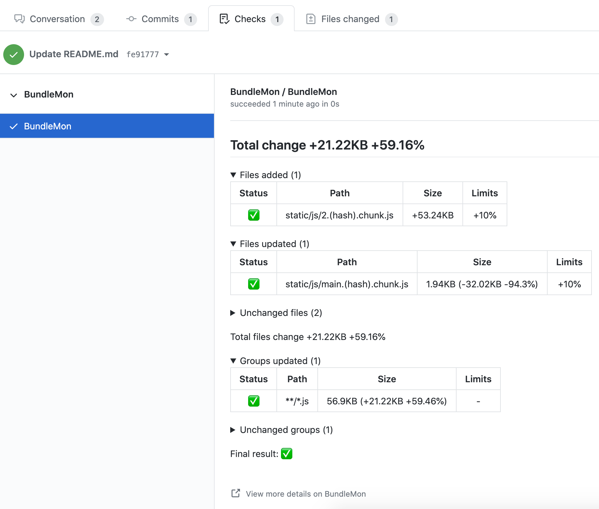
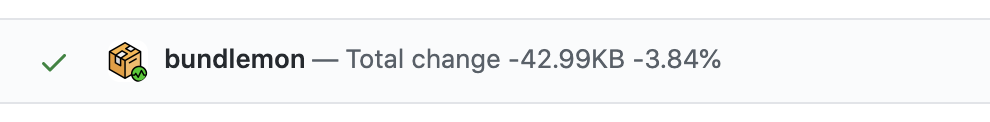
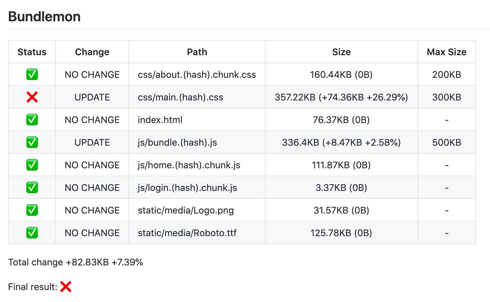

<div align="center">
  <a href="https://github.com/LironEr/bundlemon"></a>
</div>

# BundleMon

[](https://www.npmjs.com/package/bundlemon)
[](https://github.com/LironEr/bundlemon)
[](https://www.npmjs.com/package/bundlemon)
[](https://www.npmjs.com/package/bundlemon)

BundleMon helps you to monitor your bundle size.

Your goal is to keep your bundle size as small as possible to reduce the amount of time it takes for users to load your website/application. This is particularly important for users on low bandwidth connections.

BundleMon helps you achieve that by constantly monitoring your bundle size on every commit and alerts you on changes.

## Features

- Set max size for files, will fail build if exceeded
- Compare files to base branch
- Set max increase allowed in percentage from base branch, will fail build if exceeded
- Supports multiple CI
- Integrates with Github, can post build status & comment with detailed information
- History report - [example](https://app.bundlemon.dev/projects/60a928cfc1ab380009f5cc0b/reports?branch=master&resolution=days)

## Guides

- [Migration guide from v1 to v2](./docs/migration-v1-to-v2.md)
- [Step by step guide to set up BundleMon with Github actions](https://github.com/LironEr/bundlemon-github-actions)
- [Step by step guide to set up BundleMon with CodeFresh](https://github.com/LironEr/bundlemon-codefresh-example)

## Setup

```
npm install bundlemon --save-dev

# or

yarn add bundlemon --dev
```

Add `bundlemon` property to your `package.json`

```
"bundlemon": {
  "baseDir": "./build",
  "files": [
    {
      "path": "index.html",
      "maxSize": "2kb",
      "maxPercentIncrease": 5
    },
    {
      "path": "bundle.<hash>.js",
      "maxSize": "10kb"
    },
    {
      "path": "assets/**/*.{png,svg}"
    }
  ]
}
```

BundleMon config can be placed in other places like: `.bundlemonrc`, `.bundlemonrc.json`, `bundlemon.config.js` exporting a JS object, more forms can be found [here](https://github.com/davidtheclark/cosmiconfig)

| Name                 | Description                                                                                                                                                               | Type                               | Default         |
| -------------------- | ------------------------------------------------------------------------------------------------------------------------------------------------------------------------- | ---------------------------------- | --------------- |
| baseDir              | Relative/absolute path to the directory                                                                                                                                   | `string`                           | `process.cwd()` |
| files                | [Files config](./docs/types.md#File)                                                                                                                                      | `FileConfig[]`                     | -               |
| groups               | Sum all file sizes matching the pattern, rules applies to the sum of the files [Groups config](./docs/types.md#File)                                                      | `FileConfig[]`                     | -               |
| defaultCompression   | Use compression before calculating file size                                                                                                                              | `"none"` \| `"gzip"` \| `"brotli"` | `"gzip"`        |
| reportOutput         | [Output options](./docs/output.md)                                                                                                                                        | `(string \| [string, object])[]`   | []              |
| verbose              | Print more details                                                                                                                                                        | `boolean`                          | `false`         |
| subProject           | By setting sub project you can use the same project id for multiple projects. This can be useful for monorepos. Can be set/overwrite with `BUNDLEMON_SUB_PROJECT` env var | `string`                           | `undefined`     |
| includeCommitMessage | Include commit message when saving records                                                                                                                                | `boolean`                          | `false`         |

## CLI usage

You can also set some of the variables using CLI flags

```
bundlemon --config my-custom-config-path.json
```

[CLI flags docs](./docs/cli-flags.md)

## Using hash in file names?

When using hash in file names the file name can be changed every build.

In order for BundleMon to keep track of your files you can use `<hash>` to replace the hash with a constant string.

For example:

```
index.html
home.b72f15a3.chunk.js
login.057c430b.chunk.js
bundle.ea45e578.js
```

Config:

```
"bundlemon": {
  "baseDir": "./build",
  "files": [
    {
      "path": "*.<hash>.chunk.js"
    },
    {
      "path": "*.<hash>.js"
    }
  ]
}
```

Output:

```
[PASS] bundle.(hash).js: 19.67KB
[FAIL] home.(hash).chunk.js: 70.09KB > 50KB
[PASS] login.(hash).chunk.js: 3.37KB < 50KB
```

## BundleMon Project

In order to save history and get differences from your main branches BundleMon will need a project id.

**If you are running BundleMon in GitHub actions** BundleMon will detect all necessary information automatically, Just [Install BundleMon GitHub App](https://github.com/apps/bundlemon).

**If not**, you will need to create a new project and setup environment variables.

- [Create new project](https://app.bundlemon.dev/create-project) and copy the project ID and API key
- Add the ID to `BUNDLEMON_PROJECT_ID` and the API key to `BUNDLEMON_PROJECT_APIKEY` environment variables in your CI

## GitHub integration

BundleMon can create GitHub check run, post commit status and a detailed comment on your PR.


<br />

<br />


1. Setup integration

   - If BundleMon runs in GitHub actions and you already [Installed BundleMon GitHub App](https://github.com/apps/bundlemon) you can go to step 2.
   - If BundleMon not runs In GitHub actions you will need to [create GitHub access token](https://docs.github.com/en/authentication/keeping-your-account-and-data-secure/creating-a-personal-access-token).

     Add the token to `BUNDLEMON_GITHUB_TOKEN` environment variable in your CI.

     > The token is not saved in BundleMon service, ONLY used to communicate with GitHub

2. Add `github` to `reportOutput`

   ```json
   "reportOutput": ["github"]

   // override default options

   "reportOutput": [
     [
       "github",
       {
         "checkRun": false, // Only works when using Bundlemon GitHub App
         "commitStatus": true,
         "prComment": true
       }
     ]
   ]

   // each option support conditional values

   "reportOutput": [
     [
       "github",
       {
         "checkRun": false, // can also be "off"
         "commitStatus": true, // can also be "always"
         "prComment": "on-failure"
       }
     ]
   ]
   ```

   Each option support one of: `true | false | "always" | "on-failure" | "pr-only" | "off"`

   `"on-failure"` option means that **only** when BundleMon limit exceeded then it will post the output (check run / commit status / PR comment) to GitHub

### GitHub action example & forks support

BundleMon supports running on PRs originating from forks.

[Step by step guide to set up BundleMon with Github actions](https://github.com/LironEr/bundlemon-github-actions)

```yaml
name: Build

on:
  push:
    branches: [main]
  pull_request:
    types: [synchronize, opened, reopened]

jobs:
  build:
    runs-on: ubuntu-latest
    steps:
      - uses: actions/checkout@v2
      - name: Use Node.js 16
        uses: actions/setup-node@v2
        with:
          node-version: '16'

      - name: Install dependencies
        run: yarn

      - name: Build
        run: yarn build

      - name: Run BundleMon
        run: yarn bundlemon
        env:
          CI_COMMIT_SHA: ${{github.event.pull_request.head.sha || github.sha}} # important!
          CI_COMMIT_MESSAGE: ${{ github.event.head_commit.message }} # optional, set if includeCommitMessage option is true
```

> Make sure to set `CI_COMMIT_SHA` env var, more info can be found [here](https://frontside.com/blog/2020-05-26-github-actions-pull_request/#how-does-pull_request-affect-actionscheckout)

## Set additional environment variables

In order to get BundleMon to work you'll need to set these environment variables:

> If you are using one of the supported CIs (GitHub Actions, Travis and Codefresh) you dont need to set anything. CircleCI is also supported, but you need to manually set `CI_TARGET_BRANCH`.

- `CI=true`
- `CI_REPO_OWNER` - github.com/LironEr/bundlemon `LironEr`
- `CI_REPO_NAME` - github.com/LironEr/bundlemon `bundlemon`
- `CI_BRANCH` - source branch name
- `CI_COMMIT_SHA` - commit SHA
- `CI_TARGET_BRANCH` - target branch name, only set if BundleMon runs on a pull request
- `CI_PR_NUMBER` - PR number, only set if BundleMon runs on a pull request
- `CI_COMMIT_MESSAGE` - Optional, set it if `includeCommitMessage` option is `true`

## Contributing

Read the [contributing guide](./CONTRIBUTING.md) to learn how to run this project locally and contribute.
