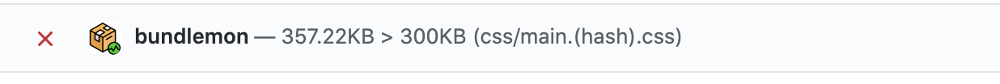

# Output

```
"reportOutput": [
  "output-plugin",
  [
    "output-plugin-with-options",
    {
      "option1": "val",
      "option2": true
    }
  ]
]
```

---

## `github`

Create check run, post commit status and a detailed comment on your PR.

[Install BundleMon GitHub App](https://github.com/apps/bundlemon)

### Example

Use default options

```
"reportOutput": ["github"]
```

Override default options

```
"reportOutput": [
  [
    "github",
    {
      "checkRun": false,
      "commitStatus": true,
      "prComment": true
    }
  ]
]
```

### Options

#### `checkRun`

type: `boolean` default: `false`

Creates check run, add a check to GitHub checks page, will also create commit status.


#### `commitStatus`

type: `boolean` default: `true`

Post commit status



#### `prComment`

type: `boolean` default: `true`

Post comment on PR


---

## `json`

Save raw results in json file.

### Example

Use default options

```json
"reportOutput": ["json"]
```

Override default options

```json
"reportOutput": [
  [
    "json",
    {
      "fileName": "fantastic-file-name.json"
    }
  ]
]
```

### Options

#### `fileName`

type: `string` default: `bundlemon-results.json`

Use custom file name for results.

---

## `custom`

Use our own implementation to output or process results.

### Example

`path` option is required.

```json
"reportOutput": [
  [
    "custom",
    {
      "path": "custom-output.js"
    }
  ]
]
```

In the root of your project create `custom-output.js`:

```js
// Function that accepts generated report as parameter
const output = (report) => {
  console.log(report);
};

module.exports = output;
```

TODO: Document report object structure.

### Options

#### `path`

type: `string`

Relative path to the js file exporting a function.
